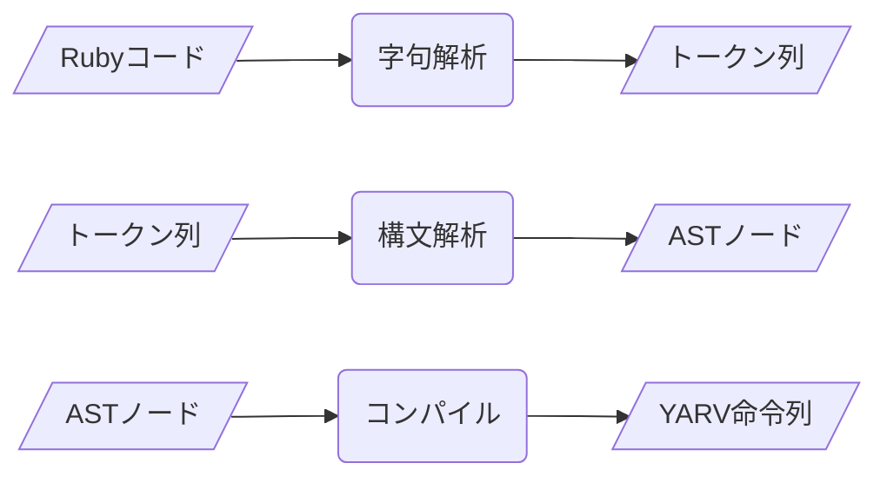

---
# try also 'default' to start simple
theme: seriph
# random image from a curated Unsplash collection by Anthony
# like them? see https://unsplash.com/collections/94734566/slidev
background: https://source.unsplash.com/collection/94734566/1920x1080
# apply any windi css classes to the current slide
class: 'text-center'
# https://sli.dev/custom/highlighters.html
highlighter: shiki
# some information about the slides, markdown enabled
info: |
  ## Slidev Starter Template
  Presentation slides for developers.

  Learn more at [Sli.dev](https://sli.dev)
---

# Rubyが実行されるまで

---

# 自己紹介

- ima1zumi
- 好きな gem は reline と irb
- キーボードは光ってるほうが好きな派

---

# 今日話すこと

- RubyスクリプトがRubyVMに実行されるまでのざっくりした流れ

---

# VMとは？

- 仮想マシン (Virtual Machine)
  - 物理的なコンピュータをソフトウェアで仮想化
- コンパイル型言語: マシン語に翻訳
- VMを使う言語: VM用のマシン語に翻訳
- VMを使うとハードウェアに依存せず実行できる
- Ruby は YARV(Yet Another Ruby Virtual Machine) というVMで動いている
  - Ruby 1.9 から導入

---

# Rubyがコードを実行するまで




---

# 字句解析
- input: Rubyのソースコード
- output: トークン列
- ソースコードのテキストを単語単位や記号単位に分割してトークンにする
- 構文として正しいかどうかは見てない
- Ripper で字句解析ができる
  - Ripper は構文解析もできる

```ruby
require 'ripper'
code = '1 + 2'

p Ripper.tokenize(code)
# => ["1", " ", "+", " ", "2"]
```

---

# Rubyがコードを実行するまで


---

# 構文解析
- input:  トークン列
- output: AST(AbstractSyntaxTree)ノード
- トークン列を読み込んでASTノードにする

```ruby
require 'ripper'
code = '1 + 2'

pp Ripper.sexp(code) # S式を出力
# => 
  [:program, [
    [:binary, 
      [:@int, "1", [1, 0]], # @イベント名、トークン、位置情報(行、桁の配列)
      :+,
      [:@int, "2", [1, 4]]
    ]]
  ]

pp RubyVM::AbstractSyntaxTree.parse(code) # 抽象構文木(AST)
# => (SCOPE@1:0-1:5
 tbl: []
 args: nil
 body: (OPCALL@1:0-1:5 (LIT@1:0-1:1 1) :+ (LIST@1:4-1:5 (LIT@1:4-1:5 2) nil)))
```

---

# Rubyがコードを実行するまで


---

# コンパイル
- input:  ASTノード
- output: YARV命令列
- YARV が実行可能なコードに変換すること
- RubyでよくつかうメソッドはYARVで最適化してある
  - `attr_accessor` など

```ruby
require 'ripper'
code = '1 + 2'

puts RubyVM::InstructionSequence.compile(code, options: false).disasm # options: false で最適化を無効 

# == disasm: #<ISeq:<compiled>@<compiled>:1 (1,0)-(1,5)> (catch: FALSE)
# 0000 putobject_INT2FIX_1_                                             (   1)[Li]
# 0001 putobject                              2
# 0003 opt_plus                               <calldata!mid:+, argc:1, ARGS_SIMPLE>
# 0005 leave

# putobject: スタックにレシーバをプッシュ
# opt_plus: 最適化された + 命令
# leave: リターン
```

---

# 参考資料

- [Rubyのしくみ　Ruby Under a Microscope](https://www.amazon.co.jp/dp/B01IGW56CU)
- [RubyでRubyVMを実装してRubyVMの気持ちになってみる - Qiita](https://qiita.com/nownabe/items/47cc5d95e8b4e01205a8)
- [Ruby’s New JIT | Square Corner Blog](https://developer.squareup.com/blog/rubys-new-jit/)
